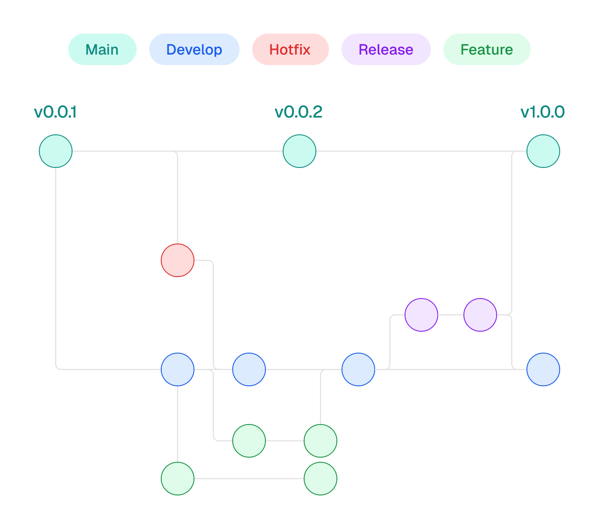

# Hynix GitFlow

This document outlines the GitFlow workflow that will be used in the Hynix
project to ensure organization and control during development.

## **Main Branches**

### 1. **main**

- Contains the **stable** version of the project, ready for production.
- Only accepts merges from `release` or `hotfix` branches.

### 2. **develop**

- Contains the code under development, with features being prepared for the next
  release.
- Accepts merges from `feat` or `hotfix` branches.

## **Supporting Branches**

### 1. **feat**

- Used for developing new features.
- Created from the `develop` branch.
- Branch name: `feat/<description>`.

**Example:**

```bash
git checkout -b feat/button-component develop
```

After development:

```bash
git checkout develop
git merge feat/button-component
```

### 2. **release**

- Used to prepare a new production release.
- Created from the `develop` branch.
- During release stabilization, only bug fixes and final adjustments are
  allowed.
- Branch name: `release/<version>`.

**Example:**

```bash
git checkout -b release/1.0.0 develop
```

After stabilization:

```bash
git checkout main
git merge release/1.0.0
git tag -a v1.0.0 -m "Release 1.0.0"

git checkout develop
git merge release/1.0.0
```

### 3. **hotfix**

- Used to fix critical issues in production.
- Created from the `main` branch.
- After fixing, the branch is merged into both `main` and `develop`.
- Branch name: `hotfix/<description>`.

**Example:**

```bash
git checkout -b hotfix/fix-button-error main
```

After the fix:

```bash
git checkout main
git merge hotfix/fix-button-error
git tag -a v1.0.1 -m "Hotfix 1.0.1"

git checkout develop
git merge hotfix/fix-button-error
```

## **Workflow**

### 1. Developing a feature

1. Create a `feat` branch from `develop`.
2. Implement the feature.
3. Test and validate.
4. Merge it back into the `develop` branch.

### 2. Preparing a release

1. Create a `release` branch from `develop`.
2. Perform final testing and bug fixes.
3. Merge it into both `main` and `develop`.

### 3. Fixing production issues

1. Create a `hotfix` branch from `main`.
2. Implement the fix.
3. Merge it into both `main` and `develop`.

## **Naming Conventions**

- **Feature:** `feat/<description>`
- **Release:** `release/<version>`
- **Hotfix:** `hotfix/<description>`

## **Example Commands**

### Creating a feature branch:

```bash
git checkout -b feat/add-navbar develop
```

### Finalizing a release:

```bash
git checkout main
git merge release/1.0.0
git tag -a v1.0.0 -m "Release 1.0.0"
```

### Fixing a critical bug in production:

```bash
git checkout -b hotfix/fix-login-error main
```

## **Workflow Diagram**

Below is an example diagram illustrating the GitFlow workflow:

<div align="center">
  
</div>
