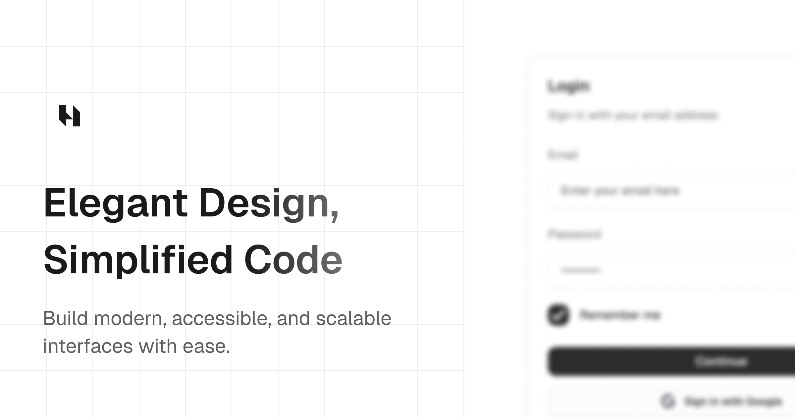

# Hynix

Hynix is a powerful collection of elegant and accessible components built with
React, Tailwind CSS, and Base UI. It is designed to simplify UI development for
developers and designers.

  

## Motivation

Hynix was created to accelerate the development of my digital products and to
offer solutions that combine accessibility with high-quality design. The library
was developed to:

- Provide a consistent and modern experience for user interfaces.
- Facilitate the construction of reusable components that follow good design
  practices.
- Empower developers to create elegant interfaces with less effort.
- Ensure that accessibility and performance are central pillars of every
  component.

We believe that great design should be inclusive, efficient, and simple to
implement.

## License

Hynix is licensed under the [MIT License](./LICENSE). Feel free to use, modify,
and distribute it under the terms of the license.
