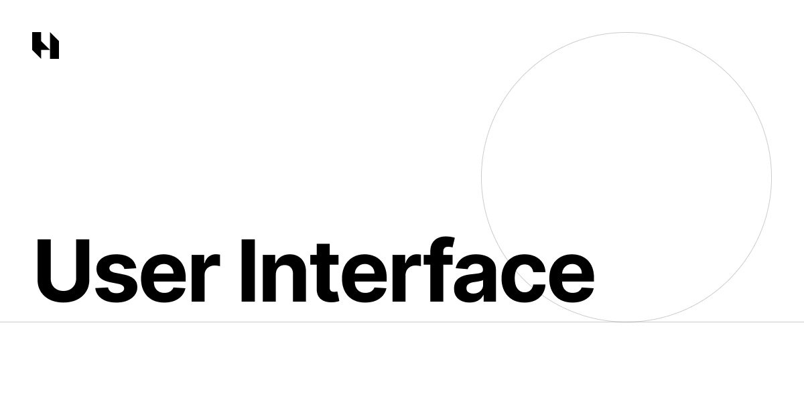

    

 

A refined collection of accessible and consistent components built with React, Tailwind CSS, and Ark UI — designed for speed, aesthetics, and a flawless experience.

## Overview

UI component library focused on accessibility, strong typing, and exceptional developer experience.

### Key Features

- **Accessible** - Built on top of Ark UI with full ARIA support
- **Type-safe** - TypeScript throughout the entire project
- **Modern** - React 19 and Tailwind CSS 4
- **Themeable** - Native light/dark mode support
- **Documented** - All components documented in Storybook

## License

[MIT License](./LICENSE) - Copyright (c) 2025 Lucas Augusto
